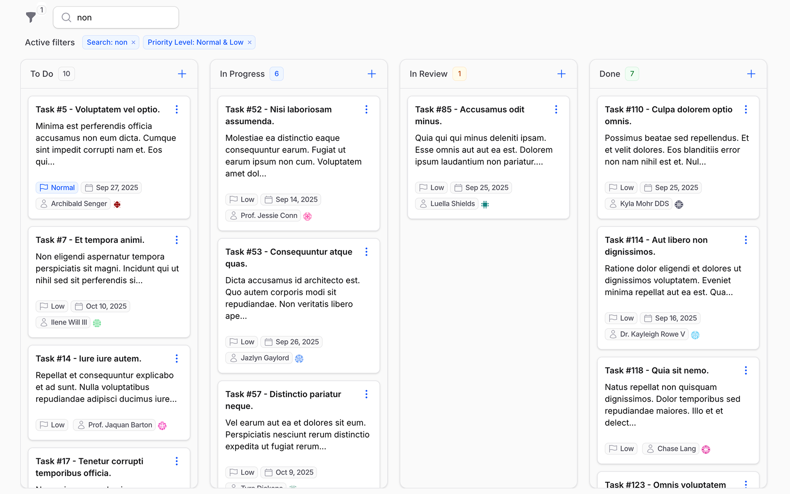

# Flowforge

Transform any Laravel model into a production-ready drag-and-drop Kanban board.



## Why Flowforge?

- **3 Integration Patterns** - Works with Filament Pages, Resources, or standalone Livewire components
- **Enterprise-Scale Performance** - Cursor-based pagination handles unlimited cards with intelligent loading
- **Rich Card Schemas** - Filament Schema builder creates complex card layouts with forms and components  
- **Smart Position Management** - Advanced ranking algorithm with conflict resolution and repair commands
- **Optimistic UI Experience** - Instant visual feedback with loading states and smooth interactions
- **Native Filament Integration** - Deep table system integration for filters, search, and actions

```bash
composer require relaticle/flowforge
```

Add CSS assets to your theme, create a position column, generate your board, and register it in your panel.

**[→ View Complete Documentation](https://relaticle.github.io/flowforge/)**
